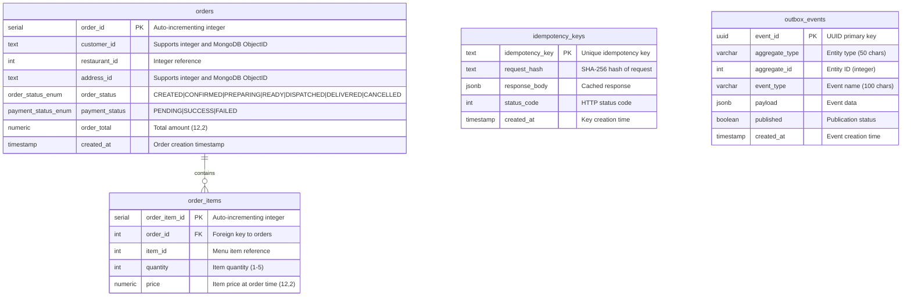

# Entity Relationship Diagram - Order Service



## Table Descriptions

### orders

Main order entity storing customer orders with pricing, status, and delivery information.

- **Primary Key**: `order_id` (SERIAL - auto-incrementing integer)
- **Indexes**:
  - `idx_orders_customer` on `customer_id`
  - `idx_orders_restaurant` on `restaurant_id`
  - `idx_orders_status` on `order_status`
  - `idx_orders_created` on `created_at`
- **Enums**:
  - `order_status`: CREATED, CONFIRMED, PREPARING, READY, DISPATCHED, DELIVERED, CANCELLED
  - `payment_status`: PENDING, SUCCESS, FAILED
- **Special Columns**:
  - `customer_id` (TEXT): Supports both integer IDs (legacy) and MongoDB ObjectIDs
  - `address_id` (TEXT): Supports both integer IDs (legacy) and MongoDB ObjectIDs
  - `restaurant_id` (INT): Integer reference to restaurant service
  - `order_total` (NUMERIC 12,2): Total order amount with 2 decimal precision

### order_items

Line items for each order with product details and quantities.

- **Primary Key**: `order_item_id` (SERIAL - auto-incrementing integer)
- **Foreign Key**: `order_id` → `orders.order_id` (CASCADE DELETE)
- **Indexes**:
  - `idx_order_items_order` on `order_id`
  - `idx_order_items_item` on `item_id`
- **Constraints**:
  - `quantity >= 1 AND quantity <= 5` (CHECK constraint)
- **Columns**:
  - `item_id` (INT): Menu item reference
  - `quantity` (INT): Item quantity (1-5)
  - `price` (NUMERIC 12,2): Item price at time of order (snapshot)

### idempotency_keys

Stores idempotency keys to prevent duplicate order creation.

- **Primary Key**: `idempotency_key` (TEXT)
- **Purpose**: Ensures exactly-once semantics in order creation
- **Columns**:
  - `request_hash` (TEXT): SHA-256 hash of request body for validation
  - `response_body` (JSONB): Cached response for idempotent requests
  - `status_code` (INT): HTTP status code of original response
  - `created_at` (TIMESTAMP): Key creation timestamp

### outbox_events

Transactional outbox pattern for reliable event publishing.

- **Primary Key**: `event_id` (UUID)
- **Indexes**:
  - `idx_outbox_published` on `published, created_at`
- **Purpose**: Ensures events are published reliably to message brokers
- **Columns**:
  - `aggregate_type` (VARCHAR 50): Entity type (e.g., 'Order')
  - `aggregate_id` (INT): Entity ID (integer reference)
  - `event_type` (VARCHAR 100): Event name (e.g., 'OrderCreated')
  - `payload` (JSONB): Event data
  - `published` (BOOLEAN): Publication status flag

## Relationships

- **orders → order_items**: One-to-Many (1:N)
  - One order can have multiple order items (max 20)
  - Cascade delete: deleting an order removes all its items
  - Created in single transaction for consistency

## External References (Not in DB)

The following IDs reference entities in other microservices:

- `customer_id` → Customer Service (MongoDB ObjectID or integer)
- `restaurant_id` → Restaurant/Menu Service (integer)
- `address_id` → Customer Service addresses (MongoDB ObjectID or integer)
- `item_id` (in order_items) → Menu/Catalog Service (integer)

## Data Types & Compatibility

### Flexible ID Support

The schema supports both integer IDs and MongoDB ObjectIDs:

**customer_id and address_id (TEXT):**

- Legacy format: `"54"` (integer as string)
- MongoDB format: `"69121597eb9d0be310631f65"` (24-character hex string)
- Backward compatible: All 300 existing orders with integer IDs still work

**restaurant_id and item_id (INT):**

- Integer only: `1`, `36`, `317`
- Used for services with integer-based IDs

### Migration History

1. **Initial Schema (1700000000000)**: Created tables with integer IDs
2. **Seed Data (1700000000001)**: Loaded 300 orders + 856 items from CSV
3. **ID Flexibility (1700000000002)**: Changed `customer_id` and `address_id` to TEXT

## Sample Data

The database contains:

- **300+ orders** (IDs 1-300 with integer customer/address IDs, 301+ with MongoDB ObjectIDs)
- **856+ order items** with realistic pricing
- Various order statuses and payment statuses
- Date range: 2022-2025

**Example Queries:**

```sql
-- Orders with integer IDs (legacy)
SELECT * FROM orders WHERE order_id <= 300;

-- Orders with MongoDB ObjectIDs (new)
SELECT * FROM orders WHERE order_id > 300;

-- Mixed customer ID formats
SELECT customer_id,
       CASE
         WHEN LENGTH(customer_id) = 24 THEN 'MongoDB ObjectID'
         ELSE 'Integer ID'
       END as id_type
FROM orders
GROUP BY customer_id;
```

## ID Format Examples

### Order with Integer IDs (Legacy - Order #1)

```json
{
  "order_id": 1,
  "customer_id": "54",
  "restaurant_id": 36,
  "address_id": "73",
  "order_status": "DISPATCHED",
  "order_total": "1666.26",
  "payment_status": "FAILED",
  "created_at": "2024-02-05T06:13:48.000Z"
}
```

### Order with MongoDB ObjectIDs (New - Order #301)

```json
{
  "order_id": 301,
  "customer_id": "69121597eb9d0be310631f65",
  "restaurant_id": 1,
  "address_id": "69121597eb9d0be310631fa3",
  "order_status": "CREATED",
  "order_total": "545.81",
  "payment_status": "PENDING",
  "created_at": "2025-11-10T16:57:12.000Z"
}
```

## Architecture Diagram

```
┌─────────────────────────────────────────────────────────────┐
│                      Order Service                          │
│                                                             │
│  ┌──────────────┐    ┌──────────────┐    ┌──────────────┐ │
│  │   orders     │───▶│ order_items  │    │ idempotency  │ │
│  │              │    │              │    │    _keys     │ │
│  │ order_id (PK)│    │ order_id (FK)│    │              │ │
│  │ customer_id  │    │ item_id      │    │ idempotency  │ │
│  │ restaurant_id│    │ quantity     │    │   _key (PK)  │ │
│  │ address_id   │    │ price        │    │ request_hash │ │
│  │ order_status │    └──────────────┘    │ response_body│ │
│  │ order_total  │                        └──────────────┘ │
│  └──────────────┘                                          │
│         │                                                  │
│         │ References (External Services)                   │
│         │                                                  │
└─────────┼──────────────────────────────────────────────────┘
          │
          ├─────▶ Customer Service (MongoDB)
          │       • customer_id: ObjectID
          │       • address_id: ObjectID
          │
          ├─────▶ Restaurant/Menu Service (PostgreSQL)
          │       • restaurant_id: integer
          │       • item_id: integer
          │
          ├─────▶ Payment Service
          │       • Processes payments
          │
          └─────▶ Delivery Service
                  • Assigns delivery

```

## Database Statistics

After initial setup and testing:

```sql
-- Total orders
SELECT COUNT(*) FROM orders;
-- Result: 305+ orders

-- Orders by ID type
SELECT
  CASE
    WHEN LENGTH(customer_id) = 24 THEN 'MongoDB ObjectID'
    ELSE 'Integer ID'
  END as customer_id_type,
  COUNT(*) as count
FROM orders
GROUP BY customer_id_type;

-- Order status distribution
SELECT order_status, COUNT(*) as count
FROM orders
GROUP BY order_status
ORDER BY count DESC;

-- Payment status distribution
SELECT payment_status, COUNT(*) as count
FROM orders
GROUP BY payment_status
ORDER BY count DESC;
```

## Notes

- **Backward Compatibility**: All 300 existing orders with integer IDs continue to work
- **Forward Compatibility**: New orders can use MongoDB ObjectIDs from Customer Service
- **Mixed Format**: Database can store both formats simultaneously
- **Type Safety**: Application layer validates ID formats via DTOs
- **Performance**: TEXT columns indexed for efficient querying
- **Migration**: Automatic migration converts INT to TEXT on startup
