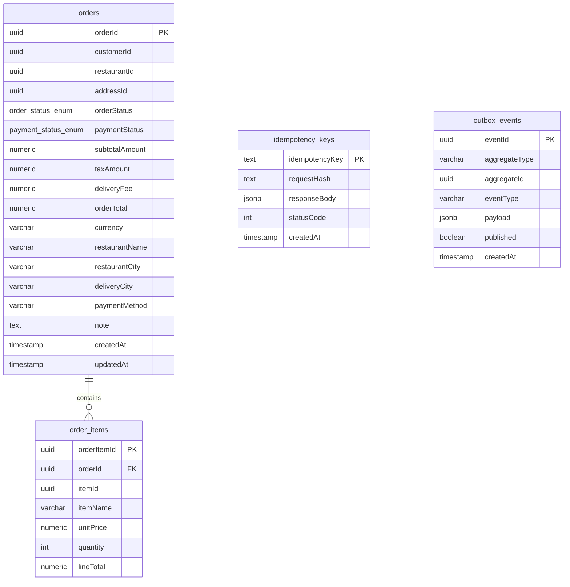

# Entity Relationship Diagram - Order Service

## Table Descriptions

### orders

Main order entity storing customer orders with pricing, status, and delivery information.

- **Primary Key**: `orderId` (UUID)
- **Indexes**: `customerId`, `createdAt`
- **Enums**:
  - `orderStatus`: CREATED, CONFIRMED, CANCELLED
  - `paymentStatus`: PENDING, SUCCESS, FAILED, NA

### order_items

Line items for each order with product details and quantities.

- **Primary Key**: `orderItemId` (UUID)
- **Foreign Key**: `orderId` → `orders.orderId` (CASCADE DELETE)
- **Indexes**: `orderId`
- **Constraints**: `quantity <= 5`

### idempotency_keys

Stores idempotency keys to prevent duplicate order creation.

- **Primary Key**: `idempotencyKey` (TEXT)
- Used for ensuring exactly-once semantics in order creation

### outbox_events

Transactional outbox pattern for reliable event publishing.

- **Primary Key**: `eventId` (UUID)
- **Indexes**: `published`, `createdAt`
- Ensures events are published reliably to message brokers

## Relationships

- **orders → order_items**: One-to-Many (1:N)
  - One order can have multiple order items
  - Cascade delete: deleting an order removes all its items

## External References (Not in DB)

The following UUIDs reference entities in other microservices:

- `customerId` → Customer Service
- `restaurantId` → Restaurant Service
- `addressId` → Address/Location Service
- `itemId` (in order_items) → Menu/Catalog Service
